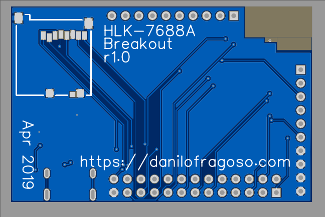

# HLK-7688A-Breakout
HLK-7688A Breakout Board - OpenWrt Linux SOM Board.

### Features
- USB Type C
- SD Card
- CP2102 Serial to USB
- 5V to 3.3V on board regulator
- On board 2.4Ghz antenna

### BOM 

| ID | 	Name  |	Designator |	Footprint	| Quantity |	Manufacturer Part |	Manufacturer |	Supplier |
| --- | --- | --- | --- | --- | --- | --- | --- |
| 1	 | 473521001 |	CARD1  |	MICRO-SD-SOCKET-PP-DETECT |	1 |	473521001 |	MOLEX |	LCSC |
| 2	 | HLK-7688A |	U1 |	HLK-7688A |	1 |	HLK-7688A |	Hi-Link Tech |	*	|
| 3	 | 2.4GHZ_F_TRACE_ANTENNA	 |U3 |	2.4GHZ_F_TRACE_ANTENNA |	1 |	New SchematicLib | * | * |			
| 4	 | CP2102-GMR	 |U4 |	QFN-28_5X5X05P |	1 |	CP2102-GMR |	SILICON LABS |	LCSC |
| 5	 | 1uF |	C1,C6,C8 |	1206 |	3 |	CC1206ZRY5V9BB105 |	YAGEO |	LCSC |
| 6	 | AMS1117-3.3 |	U2 |	SOT-223 |	1 |	AMS1117-3.3 |	AMS |	LCSC |
| 7	 | 1 |	P1 |	HDR-13X2/2.54 |	1 |	2×13Female header Straight line	 |BOOMELE |	LCSC |
| 8	 | Header-Female-2.54_1x10 |	P2,P3 |	HDR-10X1/2.54 |	2 |	2.54mm 1*10P Straight Female header Gold-plated |	BOOMELE |	LCSC |
| 9	 | 4.7uF |	C4,C5,C7 |	1206 |	3 |	CL31B475KBHVPNE |	Samsung Electro-Mechanics	 |LCSC |
| 10 | 	USB-310F |	USB2 |	USB-TYPE-S-C8.64X7.25 |	1 |	USB-310F |	HOOYA	 |LCSC |
| 11 | 	100nF	 |C10,C2 |	0805 |	2 |	0805F104M101NT |	FH |	LCSC	 |

### Schematic

- [Online PCB and Schematic editor](https://easyeda.com/danilo.fragoso/hlk-7688a "Online PCB and Schematic editor")
